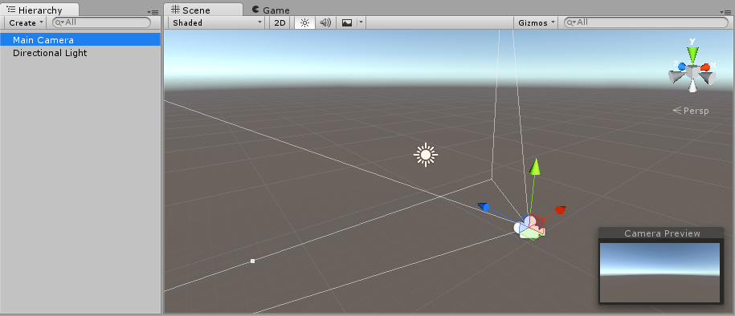
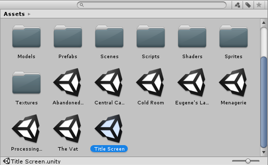
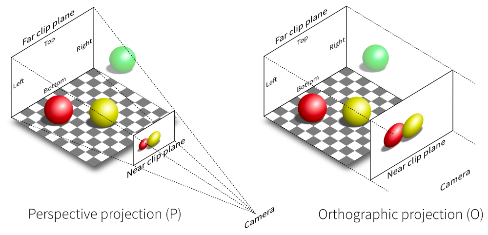
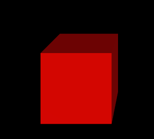

# Three.js

## Intro

WebGL(Web Graphics Library): 2D 및 3D 그래픽을 렌더링하기 위한 로우 레벨 Javascript API. 

Three.js는 WebGL을 쉽고 간편하게 사용하도록 도와주는 라이브러리.

## 개념

### Renderer

```ts
const renderer = new THREE.WebGLRenderer({
    canvas,
    antialias: true,
    alpha: true,
});
renderer.setSize(window.innerWidth, window.innerHeight);
renderer.setPixelRatio(window.devicePixelRatio > 1 ? 2 : 1);
renderer.setClearAlpha(0.3);
document.body.appendChild(renderer.domElement()) 
```
html에서 canvas 태그를 미리 선언해놓고 스타일링을 해놓고 renderer의  domElement를 반영해도 된다.
Scene을 랜더링. 카메라가 보여주는 곳을 렌더링한다.

렌더링할 캔버스태그와 antialias 옵션이 있다.

디바이스마다 사용하는 해상도와 비율로 렌더링 해상도를 정해줄 수 있다.
- 디바이스에 따라 100픽셀을 표현할 때 200px을 사용한다면 devicePixelRatio가 2로 나온다.

처음에는 화면이 시커멓게 나오는데 alpha 옵션으로 투명도를 정해줄 수 있다.

### Scene
```ts
const scene = new THREE.Scene();
renderer.render(scene, camera)
scene.background = new THREE.Color("blue"); // 배경화면 색깔 설정 가능
```



장면/무대. 무대 위에 소품, 배우, 카메라, 광원 등 모든 개체들이 올라가는 곳. 



Unity에서는 프로젝트 단위로 씬 에셋을 볼 수 있다. 장면 하나하나가 모두 모여서 드라마가 되고 영상이 되듯이 Scene이라는 단위로 생각해볼 수 있다.

### Mesh
```ts
const geometry = new THREE.BoxGeometry(1, 1, 1);
const material = new THREE.MeshBasicMaterial({
    color: 'red'
})
const mesh = new THREE.Mesh(geometry, material)
```

무대(Scene) 위에 올려지는 오브젝트. Mesh는 Geometry(모양), Material(재질)로 구성된다.


### Camera

외부에서 Scene을 보는 시야를 결정. 시야각부터 카메라의 위치, 바라보는 곳, 범위를 모두 정할 수 있다.




1. Perspective Camera
```ts
const camera = new THREE.PerspectiveCamera(
    75, // fov, field of view
    window.innerWidth / window.innerHeight, // aspect 
    0.1, // near, 카메라에서 가까이 있는지
    1000 // far, 카메라에서 멀리 있는지
);
camera.position.x = 1;
camera.position.y = 2;
camera.position.z = 5;

scene.add(camera)
```

- mesh가 near와 far 사이에 있고 시야각(fov)안에 들어와야 볼 수 있다.
- 사람의 시야처럼 원근감을 표현한다.


2. Orthographic Camera
```ts
const camera = new THREE.OrthographicCamera(
    -(window.innerWidth / window.innerHeight), // left
    window.innerWidth / window.innerHeight, // right
    1, // top
    -1, // bottom
    0.1, // near
    1000 // far
)
camera.position.x = 1;
camera.position.y = 2;
camera.position.z = 5;
camera.lookAt(0,0,0)
camera.zoom = 0.5
camera.updateProjectionMatrix()
scene.add(camera)
```

디아블로나 롤처럼 쿼터뷰로 직육면체 형태로 볼 수 있다.

- perspective와 다르게 멀리서 보려면 zoom 프로퍼티로 조정하고 updateProjectionMatrix함수도 호출해줘야한다.


### light

```ts
const light = new THREE.DirectionalLight(0xffffff, 1); // arg: color, intensity
light.position.x = 1;
light.position.z = 2;
scene.add(light);

// Mesh
const geometry = new THREE.BoxGeometry(1, 1, 1);
const material = new THREE.MeshStandardMaterial({
    color: "red",
});
const mesh = new THREE.Mesh(geometry, material);
scene.add(mesh);
```

- light를 활용하여 광원을 정해주고 그림자를 표현해줄 수 있다.
- light 객체 인스턴스를 활용하려면 mesh의 재질을 빛이 반응하는 재질로 바꿔줘야 한다.


## Animation


 


